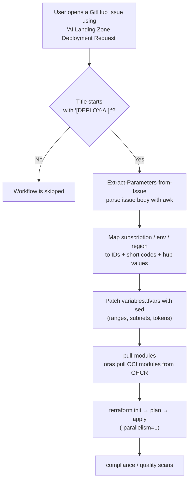

# AI Landing Zone Pattern — Self-Service Deployment Guide

This folder (`AI_Patterns/`) contains the consolidated **AI Landing Zone (AI LZ)** Terraform
pattern. It is deployed automatically when a user raises a **GitHub Issue** using the
*AI Landing Zone Deployment Request* form. This guide covers the **prerequisites** that must
be in place first, then the **issue-template → workflow → Terraform** process end to end.

The pattern provisions two spoke VNets (a shared VNet + a dedicated AI Foundry VNet), Key
Vault, Storage, ACR, an internal API Management instance, Redis, AI Search, SQL, Cosmos DB,
Event Grid, an AI Foundry account with model deployments (incl. gpt-5.1) + custom RAI policy,
and all supporting RBAC — into the selected subscription / environment / region.

---

## The three components

| Component | Path | Purpose |
|-----------|------|---------|
| Issue form (template) | [.github/ISSUE_TEMPLATE/deploy-ai.yml](../.github/ISSUE_TEMPLATE/deploy-ai.yml) | The form a user fills in to request a deployment. Title prefix **`[DEPLOY-AI]:`**. |
| Workflow | [.github/workflows/ai-pattern.yml](../.github/workflows/ai-pattern.yml) | Triggered when the issue is opened; parses the form, patches `variables.tfvars`, pulls modules, runs Terraform. |
| Terraform pattern | [AI_Patterns/](.) | The infrastructure-as-code that is actually deployed. |

---

## ⚠️ Prerequisites (must be satisfied BEFORE opening a deploy issue)

The issue-triggered pipeline runs from the **default branch (`main`)** with the deploy SPN.
The following one-time (per subscription / per region) prerequisites are **not** created by
this pattern and will cause the deploy to fail or hang if missing.

### 1. IPAM — spoke CIDR allocation
Request non-overlapping, IPAM-allocated **Class A (`10.x`)** address space per environment
from the network team. Current sizing (agreed with networking):

| VNet | Range | Subnets |
|------|-------|---------|
| Shared | `/23` | PE `/26`, Application Gateway `/26`, APIM `/26`, VM `/26` |
| Foundry | `/25` | Agent `/25` (Microsoft.App/environments delegation) |
| Foundry | `/27` | Private Endpoint `/27` |

- Both VNets peer to the SEA hub `{org}-vnet-pvt-network-pd-sea-01`, so the ranges **must not
  overlap any existing spoke** (check live hub peerings before requesting/using a range).
- **Never reuse an iterator whose Key Vaults were previously soft-deleted** — purge protection
  keeps them for 90 days, and recreating a soft-deleted KV name *recovers* the vault + its keys,
  which fails the Terraform key create with "already exists". Always pick a fresh iterator.

### 2. Resource-provider registrations (target workload subscription)
The AI Foundry account uses **born network injection** (Standard-Agent), which requires:

| Provider | Why |
|----------|-----|
| `Microsoft.App` | Container App managed environment for the agent |
| `Microsoft.ContainerService` | Managed-environment backing infrastructure |
| `Microsoft.CognitiveServices` | AI Foundry / model deployments |

Verify with `az provider show -n Microsoft.App --query registrationState` (repeat per provider).

### 3. Azure Policy exemptions (aishared resource group)
The born-injected agent stack performs backend storage deployments with defaults that the
MAS-Singapore governance denies. Without exemptions the account hangs in **Creating**.
Request exemptions on the `{org}-rg-aishared-<env>-sea-<iterator>` RG for:

- `MAS_Policy_Custom_050_03` — Storage Account Access Key Setting DENY
- `b2982f36-99f2-4db5-8eff-283140c09693` — Storage accounts should disable public network access
- `4fa4b6c0-31ca-4c0d-b10d-24b96f62a751` — Storage account public access should be disallowed

### 4. CMK Key Vault data-plane roles (account UMI)
The Foundry account is CMK-encrypted. Its user-assigned identity must hold **both** crypto
roles on the CMK Key Vault (`{org}-kv-aifoundry-*`), or gpt-5.1 model deployment fails
*"Failed to validate policies for model gpt-5.1"*:

| Role | Purpose |
|------|---------|
| `Key Vault Crypto Service Encryption User` | At-rest wrap/unwrap (account create) |
| `Key Vault Crypto User` | Full key data-plane — **required** for the gpt-5.1 / agent content-safety validation path |

Both are provisioned by `role_assignments_config_cmk` in [variables.tfvars](variables.tfvars).

### 5. Hub firewall allow-list
Both SEA firewall policies whitelist the AI LZ by supernet, so **any `10.248.0.0/16` range is
already permitted** (no per-env firewall change):

- Internal `{org}-afwp-nw-pd-sea-01` — `Allow_AI_Foundry_to_Internet` / `_to_AzurePlatformDNS` / `_to_DNS_Resolver`
- Edge `{org}-afwp-nw-pd-sea-02` — `Allow_AI_Foundry_CoreEndpoints` / `_to_ServiceTags` + APIM rules

If a deployment uses a range **outside** `10.248.0.0/16`, the source must be added to these rules.

### 6. Hub private DNS zone + SPN permission (internal APIM)
- The `azure-api.net` private DNS zone must exist in the network hub RG
  `{org}-rg-private-network-pd-<region>-01`. The pattern self-registers the internal APIM's
  A-records into it and links the shared VNet, resolving the `:3443` control-plane endpoint.
- The deploy SPN needs **Private DNS Zone Contributor** on `{org}-plt-sub-network-prd-sea-01`.

### 7. Deploy service principal roles
The region-scoped deploy SPN (`{org}-spn-ailz-nonprd-sea-01`) needs, across the workload subs:
Contributor, RBAC Administrator, Key Vault Administrator, Storage Blob Data Contributor; on
the network sub: Private DNS Zone Contributor + Network Contributor; on the mgmt sub: Log
Analytics Contributor (central ops LAW is resolved at plan time) + Storage Blob Data Contributor.

### 8. Published modules
All modules referenced by [main.tf](main.tf) must be published to GHCR with the versions pinned
in [modulesdataai.json](../modulesdataai.json). The workflow `oras pull`s them fresh each run.

---

## How it works (end to end)

1. **Trigger** — runs `on: issues: [opened]`, but only continues when the title begins with
   **`[DEPLOY-AI]:`** (set automatically by the form).
2. **Parse** — `awk` reads each `### Label` from the rendered issue body.
3. **Map** — friendly choices become the codes Terraform expects:
   - Subscription name → Azure **subscription ID**
   - Environment → short code (`Dev`→`dev`, `SIT`→`sit`, `UAT`→`uat`, `Prod`→`pd`)
   - Region → short code + hub values (`Southeast Asia`→`sea`, firewall `10.247.130.4`,
     bastion `10.247.130.128/26`, DNS resolver `10.247.130.196`)
4. **Patch tfvars** — `sed` writes the values into [variables.tfvars](variables.tfvars): the
   **first** VNet range → shared VNet, the **second** → Foundry VNet; each named subnet's
   `address_prefix`; the `iterator`, `env`, `region_code` fields; and `{env}`/`{region_code}`
   name tokens.
5. **Pull modules** — `oras` downloads the pinned modules from GHCR into `AI_Patterns/modules`.
6. **Deploy** — `terraform init/plan/apply` runs from this folder with OIDC login and
   **`-parallelism=1`** (Foundry ETag safety). State key is per env + region:
   `aiApp-<env>-<region_code>.tfstate`.

---

## What you provide (the form fields)

### Deployment target
| Field | Allowed values |
|-------|----------------|
| Subscription | `{org}-ai-sub-tier4-{dev,sit,uat}-sea-01`, `tst-sub-sea-01` |
| Environment | `Dev`, `SIT`, `UAT`, `Prod` |
| Region | `Malaysia West`, `Southeast Asia` |

### Naming & tags
`Organisation Code`, `AU Code`, `Business Unit Code`, `Owner`, **`Iterator`** (unique instance
number — see the fresh-iterator rule above), plus mandatory tags (Business Owner, Business Unit,
Criticality, Cost Center, Data Classification, Compliance, Application Name, Budget ID, Status,
Application Support Email).

### Network configuration
| Field | Notes |
|-------|-------|
| VNet Address Ranges | **Two** CIDRs, one per line — 1st = shared VNet, 2nd = Foundry VNet |
| PE / Application Gateway / APIM / VM Subnet Address Prefix | Inside the shared VNet range |
| Foundry Agent Subnet Address Prefix | Inside the Foundry range; Microsoft.App delegation |
| Foundry PE Subnet Address Prefix | Inside the Foundry range |

---

## Step-by-step: request a deployment

1. Confirm all **prerequisites** above are satisfied for the target subscription/region.
2. Issues → **New issue** → **AI Landing Zone Deployment Request**.
3. Keep the title prefix **`[DEPLOY-AI]:`** (add a short description).
4. Select Subscription / Environment / Region; review naming + tags.
5. Enter the **two VNet ranges** and all **six subnet prefixes** (non-overlapping, inside range).
6. Submit. Track progress in the **Actions** tab.
7. If a job fails, open the failed run — the deploy log names the blocking resource.

---

## Behind the scenes — fixed configuration

- **Runner:** `self-hosted, Linux, X64, vmss-sea`.
- **Azure auth:** OIDC (`AZURE_CLIENT_ID`, `AZURE_TENANT_ID`) — no stored passwords.
- **Module registry:** `vendored under each stack's `modules/` folder,
  versions pinned in [modulesdataai.json](../modulesdataai.json).
- **Terraform backend:** storage `{org}satfprdmyw01`, container `tfstatealz`, RG
  `{org}-rg-devops-pd-myw-01`, state key `aiApp-<env>-<region_code>.tfstate`.

### Subscription name → ID mapping (in the workflow)

| Subscription name | Azure subscription ID |
|-------------------|-----------------------|
| `{org}-ai-sub-tier4-dev-sea-01` | `9662b56a-a3b5-48a1-b0f6-8862241a57ca` |
| `{org}-ai-sub-tier4-sit-sea-01` | `dc1c5599-6863-47a3-81a3-8ef93cf61599` |
| `{org}-ai-sub-tier4-uat-sea-01` | `736c1205-3a01-4220-ac51-8d7415709f66` |
| `tst-sub-sea-01` | `681852db-ca84-4356-943f-d1175fc3281e` |

---

## Adding a new subscription, environment, or region

Mappings are hard-coded in the workflow, so extend **two** files:

1. Add the option to the dropdown in
   [.github/ISSUE_TEMPLATE/deploy-ai.yml](../.github/ISSUE_TEMPLATE/deploy-ai.yml).
2. Add the `case` mapping in the *Extract Parameters* step of
   [.github/workflows/ai-pattern.yml](../.github/workflows/ai-pattern.yml).

---

## Troubleshooting

| Symptom | Likely cause / fix |
|---------|--------------------|
| Workflow didn't start | Issue title must start with `[DEPLOY-AI]:`. |
| `SUBSCRIPTION_ID` empty | Subscription name not in the workflow `case` mapping. |
| Account stuck **Creating** | Missing policy exemption (§3) or RP registration (§2) — agent managed-env cannot provision. |
| gpt-5.1 *"Failed to validate policies"* | Account UMI missing the **Key Vault Crypto User** role (§4). |
| Key Vault key *"already exists - needs to be imported"* | Reused an iterator whose KVs were soft-deleted — use a fresh iterator (§1). |
| Internal APIM `:3443` 422 | Transient management-endpoint timing — re-run; ensure the `azure-api.net` zone exists (§6). |
| Peering rejected (overlap) | Chosen CIDR overlaps an existing hub spoke — pick a free range (§1). |
| Module pull failed | `GH_TOKEN` missing/expired, or module version in [modulesdataai.json](../modulesdataai.json) not published (§8). |
